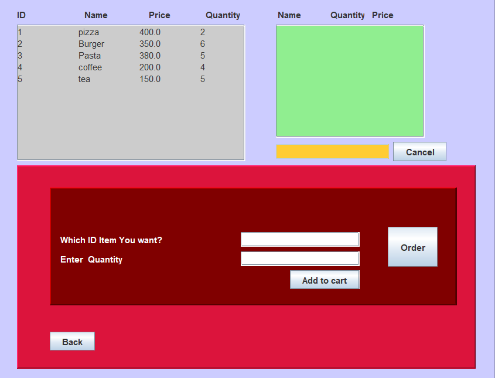

# Restaurant Ordering Management System
<p align="center">
 
</p>
<div align="center">
 
[](https://www.oracle.com/java/technologies/javase-downloads.html)
[](https://netbeans.apache.org/download/index.html)

</div>

## Overview

Elevate your restaurant's efficiency with our intuitive Order Management System. Streamline orders, enhance customer satisfaction, and bring a touch of seamless precision to your dining experience.

## Features

- **Item Management:**
  - Add, view, modify, or delete menu items.

- **Labour Management:**
  - Add, view, modify, or delete labor details.

- **Order Management:**
  - Create orders seamlessly.
------------------------------------------
## Technologies Used

- [Apache NetBeans IDE 19](https://netbeans.apache.org/front/main/download/nb19/)
- [JDK Compiler 17.0.9](https://www.oracle.com/java/technologies/downloads/)
------------------------------------------
## Installation

### Option 1: Clone Repository

1. Clone the Repository
```sh
$ git clone https://github.com/ashutoshsingh1311/restaurantmanagementsystem
```
2. Navigate to the project directory:
```sh
# On the terminal, move into restaurant-management-system directory
$ cd restaurant-ordering-system
```
3. Open the project using Apache NetBeans IDE 19.
4. Set up the JDK Compiler to 17.0.9.
5. Run the application within the IDE.
------------------------------------------
### Option 2: Download ZIP

1. **Download ZIP:** Click on the "Code" button, then select "Download ZIP".
2. **Extract Files:** Extract all the files from the downloaded ZIP.
3. **Open Apache NetBeans:** Launch Apache NetBeans IDE 19.
4. **Open Project:** Click on "Open Folder/Project" and select the extracted folder.
5. **Run the Application:** Execute the file to run the application.
------------------------------------------
## Usage

1. Navigate to the main menu.
2. Use "Item Management" to add, view, modify, or delete menu items.
3. Utilize "Labour Management" for labor-related actions.
4. Create orders from "Order Management."
5. Experience the enhanced efficiency of the Order Management System.
------------------------------------------
## Author

ashutoshsingh1311 -(https://github.com/ashutoshsingh1311)
- Ashutosh Singh
------------------------------------------
## Contact and Support

For any issues or inquiries, feel free to contact us:

- **Instagram:** [ashtoshhh](https://www.instagram.com/ashtoshhh/)
- **LinkedIn:** [Ashutosh Singh](https://www.linkedin.com/in/ashutosh-singh-16a5b4251/)
- **Email:** ashutosharena7@gmail.com
